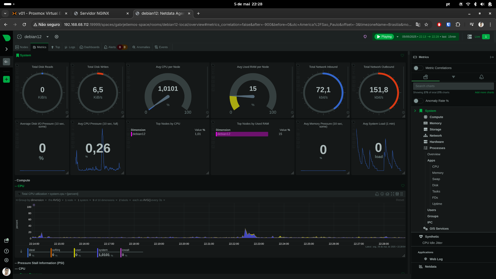
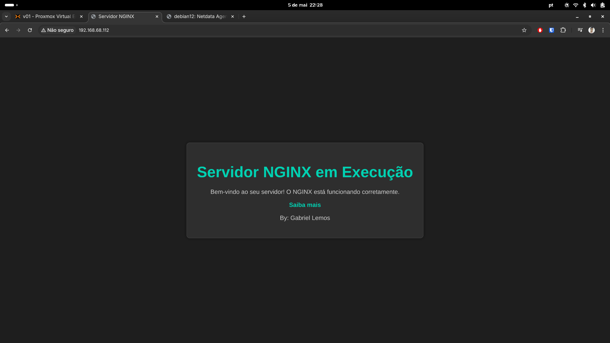

# Project: Web Server with Monitoring (Linux)

This project sets up a Linux server with:
- Nginx as the web server
- Netdata for real-time monitoring
- Firewall configuration using UFW
- Secure SSH with key authentication
- Automated installation via script

## 🔧 Technologies
- Debian 12 or Ubuntu Server 22.04
- Nginx
- Netdata
- Shell Script (Bash)
- UFW (Uncomplicated Firewall)

## 📸 Screenshots
Netdata Dashboard Runing


Nginx Running


## 🚀 Step-by-Step

### 1. Clone the repository
```bash
git https://github.com/gabriellemos42/Linux-web-server-monitoring.git
cd Linux-web-server-monitoring
```

### 2. Grant permission and Run the installation script
```bash
chmod +x scripts/install-server.sh
./scripts/install-server.sh
```

### 3. Access
- Nginx: http://SERVER_IP
- Netdata: http://SERVER_IP:19999

## 🔐 Security
- UFW enabled with minimal rules
- SSH key-based authentication (no password)

## ✍️ Author
Gabriel Lemos – [LinkedIn](https://www.linkedin.com/in/gabriel-lemos-44aa60155/)